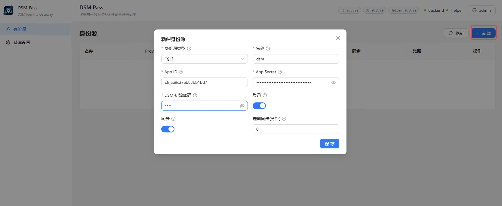
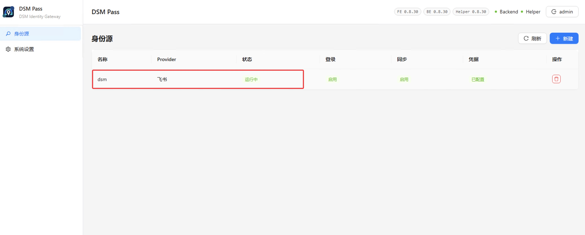
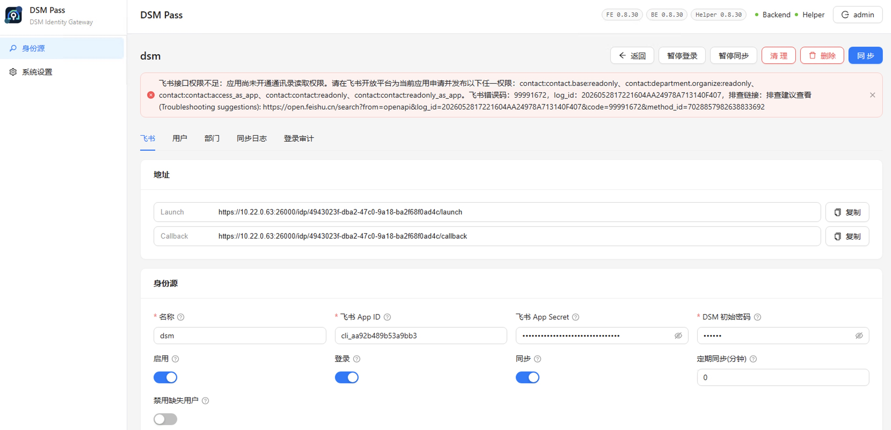
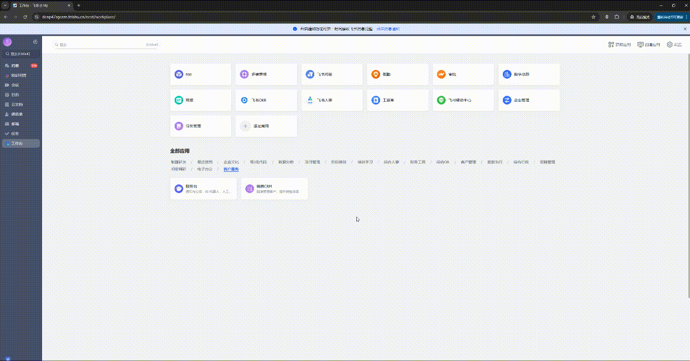
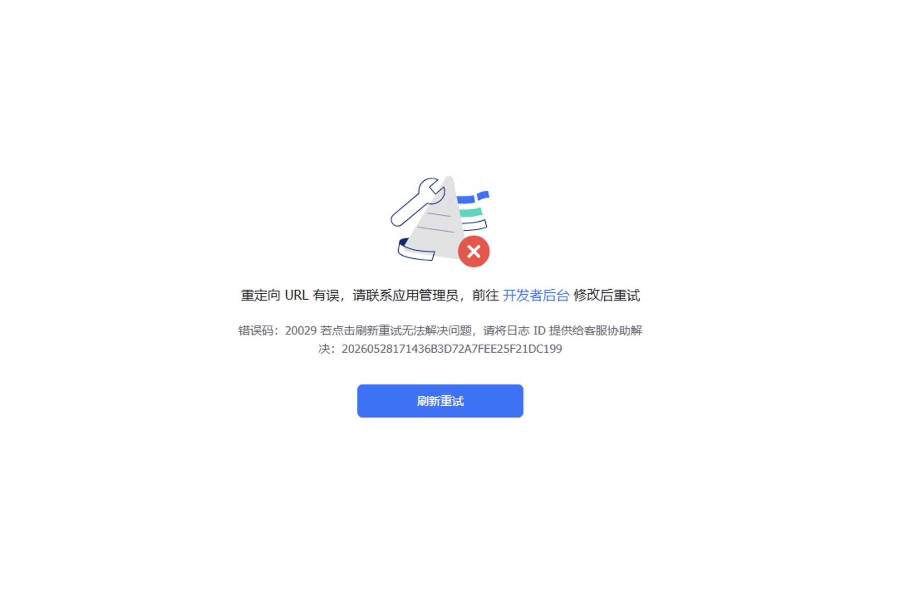
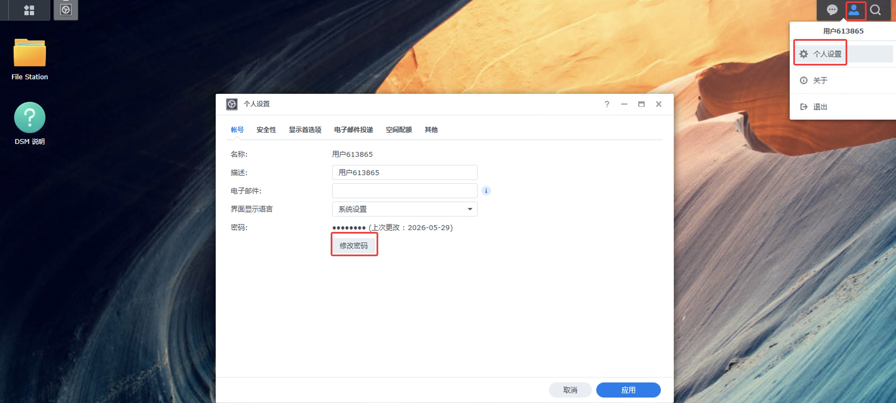

<p align="center">
  
</p>

<h1 align="center">DSM Pass</h1>

DSM Pass 是面向 Synology DSM 的企业身份登录网关。它把企业身份源、OAuth 登录、通讯录同步和 DSM 本地账号体系连接起来，让用户可以使用企业身份进入 DSM。

当前主线实现为 **Go 后端 + Go DSM Helper + React 管理后台**，支持飞书、企业微信和钉钉企业自建应用。公开 SPK 是不含 OIDC 的传统登录版，每套安装同时只允许配置一个身份源。

如需部署咨询、商业合作或技术支持，请联系 [sales@jiyou-tech.com](mailto:sales@jiyou-tech.com)。

> 项目仍处于 pre-1.0 阶段。DSM 登录中继、临时密码、Cookie 写入和 Helper 提权都属于高风险系统集成能力。生产使用前，请先在测试 NAS 上完整验证安装、升级、卸载、端口映射、登录和恢复流程。

## 目录

- [功能概览](#功能概览)
- [系统架构](#系统架构)
- [仓库结构](#仓库结构)
- [安装 DSM 套件](#安装-dsm-套件)
- [初始化后台](#初始化后台)
- [配置飞书身份源](#配置飞书身份源)
- [配置企业微信身份源](#配置企业微信身份源)
- [配置钉钉身份源](#配置钉钉身份源)
- [同步规则](#同步规则)
- [登录验证](#登录验证)
- [系统设置](#系统设置)
- [开发与测试](#开发与测试)
- [安全与公开发布](#安全与公开发布)
- [许可证](#许可证)

## 功能概览

| 能力 | 状态 |
| --- | --- |
| 飞书 OAuth 登录和通讯录同步 | 已支持 |
| 企业微信 OAuth 登录和通讯录同步 | 已支持 |
| 钉钉 OAuth 登录和通讯录同步 | 已支持 |
| DSM 用户、部门组和成员关系自动开通 | 已支持 |
| 用户级禁止登录 | 已支持 |
| 身份源级登录和同步开关 | 已支持 |
| 身份源级定时同步 | 已支持 |
| 登录审计和同步日志 | 已支持 |
| 同步、清理和批量操作进度展示 | 已支持 |
| DSM SPK 安装包 | 已支持 x86_64 / aarch64 |
| 管理后台 HTTPS | 默认启用，自签证书自动生成 |
| IDP 入口协议和端口 | 后台可配置，支持热重启 |
| IDP 入口校验 | 只允许通过系统配置的 IDP 地址访问认证入口 |
| 管理端内网访问开关 | 可选择让管理后台仅允许本机和内网访问 |

## 系统架构

```text
Browser
  -> DSM Pass Go Backend
    -> SQLite
    -> Unix Socket + HMAC
      -> DSM Helper
        -> synouser / synogroup / DSM Auth API

Feishu / WeCom / DingTalk OAuth
  -> DSM Pass IDP endpoint
    -> DSM login relay
```

| 组件 | 职责 |
| --- | --- |
| Go Backend | 管理后台 API、IDP 入口、运行配置、同步调度、审计日志和静态前端服务 |
| Go Helper | 隔离 DSM 本地账号、群组和登录中继等高权限操作 |
| SQLite | 保存身份源配置、同步结果、DSM 映射、审计日志和操作进度 |
| React Frontend | 管理后台、身份源配置、同步进度、冲突处理和系统设置 |
| SPK scripts | DSM 安装、启动、卸载、升级和 Helper sudo 初始化 |

## 仓库结构

```text
.
├── go/                         Go 后端、Helper、数据库和 DSM 打包脚本
│   ├── cmd/backend/            管理后台和 IDP 服务入口
│   ├── cmd/helper/             DSM Helper 服务入口
│   ├── internal/backend/       HTTP 路由、同步、设置、审计和操作进度
│   ├── internal/db/            SQLite schema、查询和数据访问代码
│   ├── internal/helperclient/  后端到 Helper 的 Unix Socket 客户端
│   ├── internal/helperserver/  Helper 本机服务
│   ├── internal/identity/      用户名、部门名和跨源映射规则
│   ├── internal/provider/      身份源 provider 实现
│   ├── internal/syncsvc/       通讯录同步编排
│   └── scripts/dsm/            DSM tar / SPK 打包和套件脚本
├── frontend/                   React + Ant Design 管理后台
│   ├── src/                    前端源码
│   ├── public/                 前端静态资源
│   └── package.json            前端构建、lint 和依赖配置
├── docs/                       部署、测试、发布和 provider 开发文档
├── media/                      README 图文教程截图
├── scripts/                    仓库级测试和公开检查脚本
├── .github/                    CI、发布流程、CODEOWNERS 和 Dependabot
├── Makefile                    常用开发、测试和打包入口
├── LICENSE                     AGPLv3 许可证正文
└── README.md                   项目说明
```

## 安装 DSM 套件

### 下载 SPK

当前公开版本为 [`v0.8.45`](https://github.com/jiyoutech/DSMPASS/releases/tag/v0.8.45)。这是不含 OIDC 的传统登录版，飞书、企业微信和钉钉三种身份源可以任选其一；同一套安装不能同时创建多个身份源。

获取与 NAS 架构匹配的安装包：

| NAS 架构 | 文件 |
| --- | --- |
| Intel / AMD | [`DSMPASS-0.8.45-linux-amd64.spk`](https://github.com/jiyoutech/DSMPASS/releases/download/v0.8.45/DSMPASS-0.8.45-linux-amd64.spk) |
| ARMv8 / aarch64 | [`DSMPASS-0.8.45-linux-arm64.spk`](https://github.com/jiyoutech/DSMPASS/releases/download/v0.8.45/DSMPASS-0.8.45-linux-arm64.spk) |

下载后可使用 Release 中的 [`SHA256SUMS`](https://github.com/jiyoutech/DSMPASS/releases/download/v0.8.45/SHA256SUMS) 校验文件完整性。后续版本请以 [GitHub Releases](https://github.com/jiyoutech/DSMPASS/releases) 页面为准。

### 手动安装

1. 打开 DSM「套件中心」，选择手动安装，并上传与 NAS 架构匹配的 `.spk` 文件。

   

2. 同意第三方套件安装提示。

   

3. 同意许可证。

   

4. 在安装向导中填写管理后台端口，例如 `25000`。

   

5. 确认安装并启动套件。

   

## 初始化后台

### 配置 Helper sudo 初始化脚本

DSM Pass 后端默认不以 root 权限运行。创建 DSM 用户、部门组、成员关系和登录中继等高权限操作由 Helper 执行。安装完成后，需要在 DSM 中以 root 运行一次套件自带的 sudo 规则初始化脚本。

1. 在 DSM 控制面板中新增用户定义脚本任务。

   

2. 选择以 root 运行。

   

3. 在运行命令中填写初始化脚本：

   ```bash
   /var/packages/DSMPASS/target/setup-helper-sudo.sh
   ```

   

4. 保存任务后手动运行。

   

5. 如果 DSM 显示初始化失败提示，请先确认已经为 Helper 完成提权，然后重新执行初始化任务。

   

### 首次登录

首次进入管理后台时，系统会引导创建后台管理员账号，并初始化系统运行配置。

| 配置项 | 说明 |
| --- | --- |
| IDP 协议 | 生产建议使用 `HTTPS` |
| 访问主机地址 | 填写用户能访问的 NAS IP 或域名，例如 `nas.example.com` |
| IDP 入口端口 | 建议 `26000`，必须未被占用 |
| DSM 地址 | 确认自动识别主机地址 |
| DSM Auth API | 确认自动识别主机地址 |

管理后台默认使用 HTTPS 和 DSMPASS 自签证书。测试环境可以在浏览器中继续访问；生产环境建议使用可信证书，并把管理后台限制在可信网络中。

1. 首次访问管理后台时创建后台管理员账号。

   

2. 按实际网络环境初始化系统设置。

   

## 配置飞书身份源

下面以飞书企业自建应用为完整配置示例。使用企业微信或钉钉时，在管理后台选择对应的身份源类型，并根据表单提示填写平台应用凭证。

### 创建企业自建应用

1. 打开飞书开放平台：https://open.feishu.cn/

   

2. 创建「企业自建应用」。

   

3. 在「凭证与基础信息」中获取 `App ID` 和 `App Secret`。

   

4. 回到 DSM Pass，新建「飞书」身份源，填写 `App ID`、`App Secret` 和 DSM 初始密码。

   

### 配置主页和回调地址

保存身份源后，进入身份源详情页，记录页面显示的 `Launch` 和 `Callback` 地址。

| 飞书配置项 | 填写内容 |
| --- | --- |
| 桌面端主页 | DSM Pass 身份源详情页的 `Launch` 地址 |
| OAuth 重定向 URL | DSM Pass 身份源详情页的 `Callback` 地址 |

如果后续修改 DSM Pass 的 IDP 协议、访问域名或 IDP 端口，需要同步更新飞书里的主页地址和回调地址，并重新发布应用。

1. 打开 DSM Pass 的飞书身份源详情页。

   

2. 记录页面显示的 `Launch` 和 `Callback` 地址。

   

3. 回到飞书应用，添加网页应用能力。

   

4. 将 `Launch` 地址填写到桌面端主页，并选择在浏览器中打开。

   

5. 将 `Callback` 地址填写到 OAuth 重定向 URL。

   

### 开通权限

DSM Pass 同步飞书通讯录时需要读取用户、部门、用户所属部门和部门成员关系。

| 类型 | 权限 | 用途 |
| --- | --- | --- |
| 必需 | `contact:contact.base:readonly` | 允许应用读取通讯录基础数据 |
| 必需 | `contact:user.base:readonly` | 读取用户姓名、用户 ID 等基础信息 |
| 建议 | `contact:user.basic_profile:readonly` | 登录时读取当前用户基础资料 |
| 必需 | `contact:user.department:readonly` | 读取用户所属部门，用于同步多部门用户和组成员关系 |
| 必需 | `contact:department.base:readonly` | 读取部门名称、部门 ID 等基础信息 |
| 必需 | `contact:department.organize:readonly` | 读取部门上下级组织架构 |
| 按需 | `contact:user.email:readonly` | 需要同步邮箱字段时开启 |
| 按需 | `contact:user.phone:readonly` | 需要同步手机号字段时开启 |

`corehr:department:read` 和 `directory:department.name:read` 属于飞书其他通讯录或人事接口权限，当前 DSM Pass 同步不会调用这些接口；如果已经开通可以保留，但不属于最小必需权限。

1. 在飞书应用的权限管理中点击开通权限。

   

2. 搜索并开通上表列出的通讯录权限。也可以参考截图快速核对，但不要把截图视为最小权限清单。

   

3. 配置权限范围并保存。

   

4. 创建新的应用版本。

   

5. 配置应用可用范围。

   

6. 提交发布。权限、主页和回调地址只有随应用版本发布后才会对用户生效。

   

## 配置企业微信身份源

企业微信需要使用企业自建应用。公开 SPK 同一套安装只能配置一个身份源；如果已经创建飞书或钉钉身份源，需要先确认是否要改用企业微信。

### 创建企业自建应用

1. 打开[企业微信管理后台](https://work.weixin.qq.com/wework_admin/frame#apps)，进入「应用管理」，创建企业自建应用。

   

2. 填写应用名称、介绍和图标，并设置应用可见范围。需要登录或同步的成员和部门必须包含在可见范围内。

   

3. 在「我的企业 > 企业信息」中记录 `CorpID`，在自建应用详情页记录 `AgentId`，并按企业微信提示获取应用 `Secret`。这些值属于敏感凭证，不要写入 README、日志或 issue。

   

4. 回到 DSM Pass，新建「企业微信」身份源，填写 `CorpID`、`AgentId`、`Secret` 和 DSM 初始密码，然后保存。

   

### 配置授权域名与可信 IP

保存身份源后，在详情页记录 `Launch` 和 `Callback` 地址，并按企业微信当前管理后台的提示完成以下设置：

| 企业微信配置项 | 填写内容 |
| --- | --- |
| 网页授权及 JS-SDK 域名 / OAuth 回调域 | `Callback` 地址对应的域名；是否填写端口以企业微信页面提示为准 |
| 企业可信 IP | DSM Pass 访问企业微信接口时实际使用的出口公网 IP |
| 应用可见范围 | 需要登录或同步到 DSM 的成员和部门 |

如果 NAS 位于 NAT 或反向代理后面，「企业可信 IP」通常不是用户访问 NAS 时使用的入口 IP，而是后端请求企业微信 API 时的出口公网 IP。域名校验、可信域名或其他校验项应按企业微信当前后台提示完成。

修改 DSM Pass 的 IDP 协议、访问域名或端口后，`Launch` 和 `Callback` 会随之变化，需要同步更新企业微信应用配置。接口与扫码授权流程可参考企业微信官方文档：[获取 access_token](https://developer.work.weixin.qq.com/document/path/91039)、[构造扫码登录链接](https://developer.work.weixin.qq.com/document/path/91022)和[获取登录用户身份](https://developer.work.weixin.qq.com/document/path/91023)。

### 验证企业微信登录与同步

1. 访问身份源详情页显示的 `Launch` 地址，确认可以进入企业微信扫码授权页，并在授权后返回 DSM。
2. 点击「同步」，检查用户、部门、成员关系和同步日志。
3. 如果出现权限或可信 IP 错误，先按错误码检查应用可见范围、企业可信 IP、应用 `Secret` 和相关通讯录权限，再重新同步。

## 配置钉钉身份源

钉钉需要使用企业内部应用。钉钉新版开发者后台通常将旧称 `AppKey`、`AppSecret` 显示为 `Client ID`、`Client Secret`；DSM Pass 当前表单仍使用「钉钉 AppKey」和「钉钉 AppSecret」标签，两组名称分别对应同一组凭证。

### 创建企业内部应用

1. 打开[钉钉开放平台](https://open.dingtalk.com/)，进入「应用开发 > 企业内部应用」，创建应用。
2. 在应用凭证页面记录 `Client ID` 和 `Client Secret`，不要在公开文档、日志或 issue 中披露。
3. 回到 DSM Pass，新建「钉钉」身份源，将 `Client ID` 填入「钉钉 AppKey」，将 `Client Secret` 填入「钉钉 AppSecret」，并填写 DSM 初始密码。

### 配置网页应用与回调

1. 在钉钉应用中添加「网页应用」能力。

   

2. 将 DSM Pass 身份源详情页的 `Launch` 地址配置为应用首页地址，将 `Callback` 地址配置为 OAuth 回调地址。
3. 如果修改了 DSM Pass 的 IDP 协议、访问域名或端口，需要更新钉钉中的首页和回调地址，并重新发布应用版本。

### 开通最小权限并发布

当前同步和登录流程会用到以下权限。钉钉后台的权限名称可能随版本调整，应以当前页面和接口错误码为准，只开通业务所需的最小范围。

| 类型 | 权限 | 用途 |
| --- | --- | --- |
| 必需 | `Contact.User.Read` | OAuth 登录后读取当前用户基础信息 |
| 必需 | `qyapi_get_department_list` | 读取部门详情和子部门 |
| 必需 | `qyapi_get_member` | 读取成员详情 |
| 必需 | `qyapi_get_department_member` | 读取部门成员 |
| 按需 | `fieldMobile` | 需要同步手机号字段时开启 |
| 按需 | `fieldEmail` | 需要同步邮箱字段时开启 |

1. 在权限管理中开通登录用户信息读取权限。

   

2. 开通同步所需的部门和成员读取权限。截图用于定位权限入口，最小权限范围以上表为准。

   

3. 创建应用版本，并确认版本使用正确的网页应用能力。

   

4. 设置应用可见范围，使需要登录和同步的成员能够使用应用。

   

5. 提交并发布应用版本，等待配置生效。

   

### 验证钉钉登录与同步

1. 访问 `Launch` 地址，确认可以进入钉钉扫码授权页，并在授权后返回 DSM。
2. 在 DSM Pass 中执行一次手动同步，检查用户、部门、成员关系和同步日志。
3. 如果接口返回权限错误，根据错误码核对应用权限、可见范围和版本发布状态。具体平台操作可参考[钉钉开放平台教程](https://open.dingtalk.com/tutorial/)。

## 同步规则

### 名称生成与校验

DSM Pass 会根据身份源用户和部门生成 DSM 用户名与群组名。当前传统版的主要规则如下：

- 用户名和群组名最长为 32 个 Unicode 字符。
- 名称保留 Unicode 字母、数字以及 `_`、`-`、`.`；自动生成时会移除空白、控制字符和其他不支持的符号，并去除首尾的 `.`、`_`、`-`。
- 部门路径中的 `/`、`\\`、`>` 会在生成群组候选名时转换为 `_`。
- 管理员手动解决冲突时，输入必须已经是最终有效的 DSM 名称；如果仍需系统清洗，页面会拒绝保存并提示修改。

### 用户处理

如果身份源中只有一个用户映射到某个 DSM 用户名，而 DSM 本地已经有同名用户，DSM Pass 会直接建立身份源用户和 DSM 用户的映射，并把状态标记为「已关联」。这种情况不是冲突，不会要求管理员改名，也不会新建另一个 DSM 用户。

只有身份源通讯录里有多个用户清洗后会生成同一个 DSM 用户名时，DSM Pass 才会要求管理员处理。系统会先生成临时名，冲突处理窗口会把同名用户放在一起展示，并标记为身份源内重名。

如果 DSM Pass 数据库里已经有另一个身份占用了同一个 DSM 用户名，页面会标记为「已被其他身份占用」，管理员需要决定修改哪一条或两条都修改。


### 部门组处理

DSM 本地群组不支持身份源中可能存在的同名部门层级。DSM Pass 遇到部门名重名时会先生成临时路径名并标记为冲突，等待管理员确认。

同名部门不会自动开通。打开身份源详情时如果还有冲突，页面会弹出冲突处理窗口；管理员可以参考身份源部门路径，把其中任意一个或多个改成最终 DSM 部门组名。冲突部门处理完成前，同步不会继续开通 DSM 用户和成员关系，避免权限落到错误部门。


### 多部门与父部门继承

身份源用户可以同时属于多个部门。DSM Pass 会把用户加入每个直接所属部门对应的 DSM 群组，同时沿部门树向上加入所有父部门群组；重复的成员关系会自动去重。这样可以保留企业通讯录中的多部门归属和上级部门权限范围。

### 手动同步

回到 DSM Pass 身份源详情页，点击「同步」。同步完成后检查：

| 页面 | 检查内容 |
| --- | --- |
| 用户 | 身份源用户是否映射为 DSM 用户 |
| 部门 | 身份源部门是否映射为 DSM 部门组 |
| 成员 | 部门成员关系是否已经生成 |
| 同步日志 | 是否存在阻断、失败或权限不足错误 |

1. 在身份源详情页点击「同步」。

   

2. 如果同步提示身份源接口权限不足，回到对应平台检查权限是否已经开通、审批并随版本发布。

   

3. 回到 DSM 控制面板，检查用户与群组是否已正确创建。

   

## 登录验证

完整登录流程如下：



验证步骤：

1. 打开 DSM Pass 身份源详情页，复制页面显示的 `Launch` 地址。

   

2. 访问 `Launch` 地址，浏览器会跳转至飞书登录页面。

   

3. 完成飞书登录并授权。

   

4. 如果授权后提示回调地址错误，检查飞书应用里的 OAuth 重定向 URL 是否与 DSM Pass 页面显示的 `Callback` 一致。

   

5. 如果浏览器尚未信任 NAS 的 HTTPS 证书，先打开 DSM 页面完成证书信任，再继续登录。

   

   

   

6. 登录成功后进入 DSM。如果后续需要使用 SMB 等本地密码场景，可以在 DSM 个人设置中修改密码；当前密码为 DSM Pass 身份源中配置的初始密码。

   

## 系统设置

系统设置用于维护管理后台、公开 IDP 入口、DSM 登录中继、访问限制和 HTTPS 证书。修改配置前，应先确认 NAS 的端口映射、反向代理和防火墙策略，避免用户登录入口不可达。

### 入口与域名

| 配置项 | 说明 |
| --- | --- |
| 管理后台端口 | 由套件安装或启动参数提供，在页面中只读显示 |
| IDP 公开协议与地址 | 用户访问 OAuth 入口时使用的协议和主机名，可以是 NAS 地址或反向代理域名 |
| IDP 本地监听端口 | DSM Pass 在 NAS 上实际监听的端口；修改后系统会尽量热重启 IDP 服务 |

直接暴露 NAS 端口时，公开地址和本地端口通常一致；使用反向代理时，公开地址填写代理对用户暴露的域名和端口，本地端口填写代理回源到 DSM Pass 的监听端口。

修改 IDP 公开协议、域名或端口会改变各身份源详情页中的 `Launch` 和 `Callback`。保存后必须同步更新飞书、企业微信或钉钉应用后台的主页与回调配置，并按平台要求重新发布版本。

### DSM 登录链路

确认 DSM 地址、DSM Auth API 地址和登录模式与当前 NAS 环境一致。地址应包含正确的 `HTTP` 或 `HTTPS` 协议；「跳过 DSM TLS 校验」只适合受控测试环境，生产环境应安装可信证书并保持证书校验开启。

### 访问安全

启用「管理后台仅允许本机和内网访问」后，管理接口只接受本机、私有网络和系统允许的管理网段。系统会校验当前客户端地址，避免保存配置后立即把当前管理员锁在外面。远程管理场景应先确认反向代理传递的客户端地址和允许网段是否正确。


### 证书与路由

管理后台和 IDP 入口使用独立的证书槽位，可以分别上传完整证书链和私钥。新证书保存后会用于后续建立的 HTTPS 连接，通常无需重启整个套件。私钥不会显示在页面中，也不应通过日志或公开渠道传递。

当上传的证书包含明确的非通配符 DNS 名称时，页面可以用该名称更新 IDP 访问主机；通配符证书不会自动推断具体业务域名。无论证书是否自动更新地址，身份平台中的主页和 OAuth 回调仍需人工核对。

系统设置页还提供管理端与 IDP 路由刷新操作，用于配置变更后重新加载监听入口。执行后应分别访问管理后台和身份源 `Launch` 地址，确认两个入口都可用。


## 开发与测试

### 环境要求

| 工具 | 建议版本 |
| --- | --- |
| Go | `1.26.4` |
| Node.js | `>=22.12.0` |
| npm | `>=10.0.0` |

### 常用命令

```bash
# 安装前端依赖
make frontend-install

# 运行全部测试和公开文档检查
make test

# 只运行 Go 测试
make go-test

# 只运行前端构建
make build-frontend

# 只运行公开文档检查
make docs-test
```

前端也提供独立命令：

```bash
cd frontend
npm run lint
npm run build
```

Go 测试默认使用仓库内缓存目录，避免污染系统级 Go 缓存：

```bash
cd go
GOCACHE="$PWD/.gocache" GOMODCACHE="$PWD/.gomodcache" go test ./...
```

## 安全与公开发布

- 不要提交真实身份源应用密钥、OAuth token、DSM SID、Cookie、临时密码、生产证书私钥、日志或数据库。
- README 截图发布前需要人工确认已移除组织名、真实域名、真实用户信息和敏感配置。
- 生产环境建议使用可信 HTTPS 证书，并限制管理后台访问范围。
- 发现安全问题时，请先通过 [sales@jiyou-tech.com](mailto:sales@jiyou-tech.com) 私下联系维护者，不要在公开 issue 中披露可利用细节。
- 公开发布前执行 `make test`，并参考 [docs/publication-guidelines.md](docs/publication-guidelines.md)。

## 许可证

DSM Pass 以 GNU Affero General Public License v3.0 only（`AGPL-3.0-only`）授权，详见 [LICENSE](LICENSE)。
